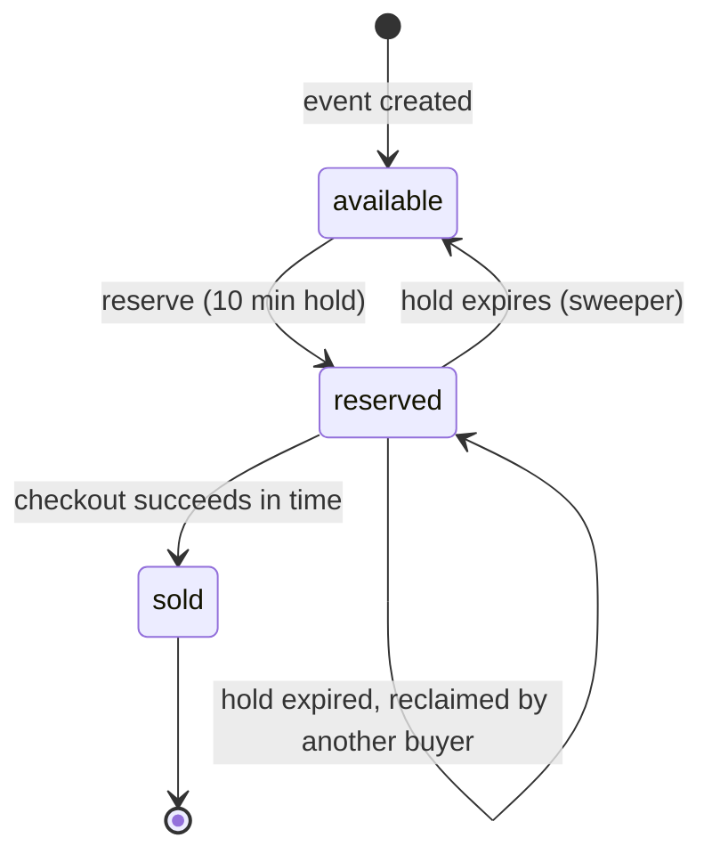

# Ticketing: Oversell-Proof Reservations Under Load

A high-concurrency event ticketing API built with Django REST Framework and PostgreSQL. An organizer creates an event with a fixed pool of tickets; buyers reserve a ticket for 10 minutes, then pay to make it permanently theirs. Hundreds of simultaneous buyers can hit the last few tickets and **the system never sells more tickets than exist**.

**Stack:** Django 5 · DRF · PostgreSQL 16 · Celery + Redis · Docker Compose · Locust

## The core problem

When 500 people click "buy" in the same millisecond on a 50-ticket event, a naive implementation (`if tickets_left > 0: tickets_left -= 1`) has a race window between the check and the write, so several buyers can pass the check before any of them writes. The fix has to live in the database, because the application can run as many processes as it likes.

## How it works

### Ticket lifecycle



### Design decisions

**1. One row per ticket, not a counter.** Creating an event inserts N `Ticket` rows. "Tickets remaining" is a count of rows in the `available` state, so there is no counter that can drift out of sync with reality, and each ticket has a single owner at any time.

**2. `SELECT ... FOR UPDATE SKIP LOCKED` for reservations.** Each request locks and claims one available row. With plain `FOR UPDATE`, 500 requests would queue behind the same first row. With `SKIP LOCKED`, each request skips rows already locked by others and takes the next free one, so reservations proceed in parallel and still never hand the same ticket to two people. The whole operation is a single transaction.

**3. Expiry is enforced at read time, not by a background job.** The reserve query treats a reservation whose `reserved_until` has passed as claimable. A Celery beat sweeper also returns expired holds to `available` every minute, but that only keeps stored data and counts tidy. If Redis or the worker goes down, the system stays correct, and only the data lags. Correctness and housekeeping are deliberately separate.

**4. Database-level safety net.** A `CheckConstraint` makes impossible ticket states unrepresentable (for example, a `reserved` ticket must have a holder and an expiry). A bug in application code cannot persist a corrupt state.

**5. Checkout: charge outside the lock, verify inside it.** Payment providers are slow, so the charge happens *outside* any DB transaction, and no row lock is held across a network call. After payment succeeds, the ticket is re-locked and re-verified (still reserved, still this user's, not expired). If the hold lapsed while payment was in flight, the payment is refunded and the request fails with `410 Gone` rather than selling a ticket the buyer no longer holds.

**6. Idempotent payments.** Each checkout carries a client-generated `idempotency_key`, enforced by a unique constraint on the payment record. A double-click or a retried request cannot charge twice.

**7. Payments behind an interface.** The `payments` app defines a small provider interface with a mock implementation that can simulate success, declines, outages, and slow responses on demand. That makes the hard cases (like paying just after a hold expires) reproducible in tests. Swapping in a real provider means writing one class.

## API

| Method | Path | Auth | Description |
|---|---|---|---|
| `GET` | `/api/events/` | none | List events with live `tickets_available` |
| `POST` | `/api/events/` | required | Create an event (generates the ticket pool) |
| `GET` | `/api/events/<id>/` | none | Event detail |
| `POST` | `/api/events/<id>/reserve/` | required | Reserve one ticket for 10 minutes. `201` on success, `409` if sold out or you already hold one |
| `POST` | `/api/tickets/<id>/checkout/` | required | Pay for a reserved ticket. `200` sold, `402` declined, `410` reservation expired |

## Running it

```bash
docker compose up --build
docker compose exec web python manage.py migrate
docker compose exec web python manage.py createsuperuser
```

The API is at http://localhost:8000 and Django admin at http://localhost:8000/admin/. The `worker` and `beat` containers run the expiry sweeper.

## Tests

```bash
docker compose run --rm web python manage.py test events -v 2
```

- **`test_concurrency`**: 200 threads (each with its own DB connection) race for 50 tickets. Asserts exactly 50 succeed, exactly 150 get sold-out, and no ticket is held twice. It uses `TransactionTestCase` because a plain `TestCase` wraps everything in one transaction and would hide the race.
- **`test_checkout`**: happy path, declined card, expired hold, **hold expiring while payment is in flight**, and duplicate idempotency keys.
- **`test_sweeper`**: releases only expired holds, never touches active reservations or sold tickets, and is idempotent.
  
  


## Load test

Locust simulates a thundering herd: every simulated buyer fires one purchase attempt the instant it spawns, and about 70% go on to check out while the rest abandon their hold. Load tests run against gunicorn (4 workers x 2 threads) rather than Django's dev server.

```bash
docker compose -f docker-compose.yml -f docker-compose.loadtest.yml up -d --build
docker compose exec web python manage.py migrate
docker compose exec web python manage.py seed_load_test --users 500 --tickets 50

pip install -r requirements-dev.txt
locust -f loadtest/locustfile.py --headless -u 500 -r 500 -t 60s \
       --host http://localhost:8000 --csv loadtest/results

docker compose exec web python manage.py verify_inventory <event_id>
```


`verify_inventory` checks the invariants directly against the database: total ticket rows unchanged, `sold <= total`, all status buckets sum to the total, and no user holds more than one ticket.


## Trade-offs and known limitations

- **Sold-out can be a brief false negative.** `SKIP LOCKED` makes a ticket that another in-flight request has locked invisible. If that request rolls back a moment later, the ticket becomes free again, but someone may already have been told "sold out." Clients should treat `409` near the end of a sale as "try again shortly." Guaranteeing "no false sold-out" would mean serializing reservations behind one lock, trading throughput for exactness.
- **The sweeper runs on a 60-second cadence**, so stored `available` counts can lag by up to a minute. Reservation correctness is unaffected (see decision 3).
- **Payment refunds are simulated.** A production system would also reconcile with the provider through webhooks, since a process can crash between a successful charge and recording it.
- **The `simulate` field on checkout is a demo hook** for exercising failure paths. Remove it or gate it behind `DEBUG` before exposing this anywhere real.
- **Single database.** This design scales with Postgres. Beyond that, the next steps would be a Redis waiting room or rate limiter in front of the reserve endpoint to smooth the initial spike.

## Project layout

```
config/      Django project, Celery app
events/      Event/Ticket models, reservation and checkout services, sweeper, tests
payments/    Payment provider interface, mock provider, payment records
loadtest/    Locust scenario
```
